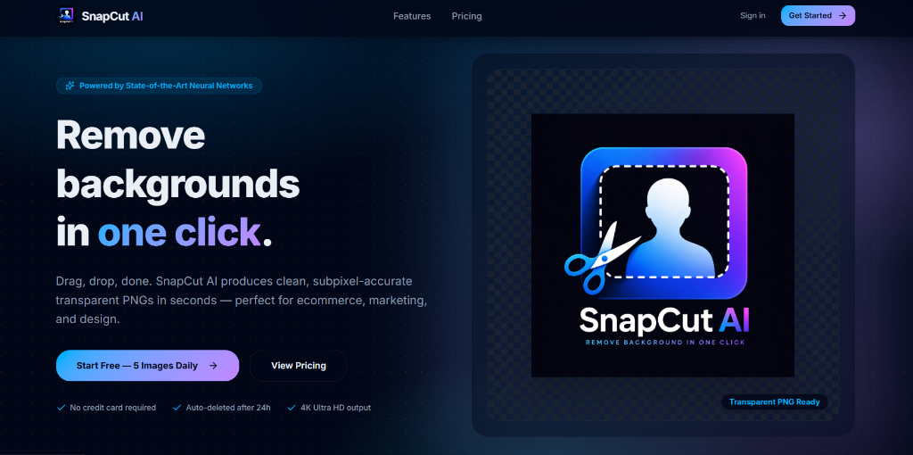
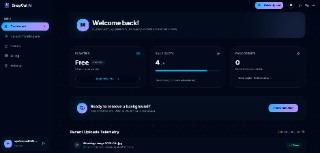
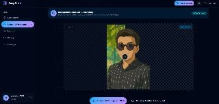

<p align="center">
  
</p>

<h1 align="center">✂️ SnapCut AI</h1>

<p align="center">
  <b>Remove image backgrounds in one click</b> with subpixel accuracy powered by state-of-the-art neural networks.
</p>

<p align="center">
  <a href="https://snapcut-ai-core.vercel.app">
    
  </a>
</p>

<p align="center">
  <a href="#features">Features</a> •
  <a href="#tech-stack">Tech Stack</a> •
  <a href="#quick-start">Quick Start</a> •
  <a href="#license">License</a>
</p>

<p align="center">
  
  
  
  
  
  
</p>

---

## 📸 Application Previews

Explore the modern interface of SnapCut AI, including the landing page, user dashboard, and AI-powered background removal workspace.

<div align="center">

### 🌟 Landing Page
<a href="docs/screenshots/hero-preview.png">
  
</a>

<br/>

| 📊 User Dashboard | ✂️ Background Removal Studio |
| :---: | :---: |
| <a href="docs/screenshots/dashboard-preview.jpg"></a> | <a href="docs/screenshots/removal-preview.jpg"></a> |

</div>

---

<a id="features"></a>
## ✨ Features

- 🎯 **One-Click Background Removal**: Subpixel-accurate cutouts delivering transparent PNGs in seconds.
- ⚡ **High Performance Studio**: Drag & drop workflow with real-time before/after comparison view.
- 📊 **Usage Telemetry & Quota**: Built-in daily free image quotas (5/day) and paid credit token tracking.
- 🛡️ **Secure Authentication & RLS**: Enterprise-grade access control backed by Supabase Auth & SQL Row Level Security.
- 🎨 **Modern Dark Aesthetic**: Sleek glassmorphism UI built with Tailwind CSS v4 and Framer Motion micro-animations.

---

<a id="tech-stack"></a>
## 🛠️ Tech Stack

- **Frontend Core**: React 19, TypeScript 5.8
- **Routing & State**: TanStack Router, TanStack Query
- **Styling & UI**: Tailwind CSS v4, Radix UI Primitives, Lucide Icons, Framer Motion
- **Backend & Auth**: Supabase (PostgreSQL, Storage, Auth, Edge Functions & RLS Policies)
- **Build Tool**: Vite 8

---

<a id="quick-start"></a>
## 🚀 Quick Start

### 1️⃣ Clone the Repository
```bash
git clone https://github.com/prashantxdev/snapcut-ai-core.git
cd snapcut-ai-core
```

### 2️⃣ Install Dependencies
```bash
npm install
```

### 3️⃣ Set Up Environment Variables
Create a `.env` file in the root directory:
```env
VITE_SUPABASE_URL=https://your-supabase-project.supabase.co
VITE_SUPABASE_ANON_KEY=your-supabase-anon-key
```

### 4️⃣ Start Development Server
```bash
npm run dev
```
Open [http://localhost:5173](http://localhost:5173) in your browser.

---

<a id="license"></a>
## 📜 License

Distributed under the MIT License. See `LICENSE` for more information.
